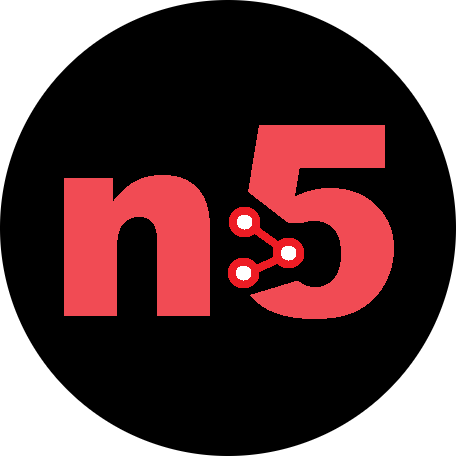

# n5 Deep Learning Framework 🚀

<p align="center">
  <picture>
    
  </picture>
</p>


A lightweight, modular, and dynamic deep learning framework built completely from scratch in Python and NumPy. It features advanced mathematical optimization paths, static operational layers, and a native structural `.n5` model serialization system.

---

## 🌟 Architecture Overview

The framework is divided into two decoupled programmatic engines:
1. **`f5` (Mathematical Engine)**: Handles advanced activation functions (`ReLU`, `Leaky ReLU`, `Sigmoid`, `Tanh`, `Softmax`, `ELU`, `SELU`, `GELU`), their analytical derivatives, and complex loss metrics (`MSE`, `MAE`, `BCE`, `Huber`, `Hinge`).
2. **`nn5` (Structural Engine)**: Manages object-oriented neural components including the state-tracking `Dense` layer (with native He/Variance initialization) and the sequential graph execution container (`Sequential`).

---

## 🛠️ Repository Structure

```text
├── checkpoint/   # Directory containing legacy development snapshots
├── n5.py          # Core engine (f5 math hub & nn5 deep learning modules)
├── main.py        # Project entry point (Training scripts and testing pipelines)
├── model.n5       # Packed production-ready structural binary model file
├── LICENSE        # Copyright & Non-Commercial Protection Notice
└── README.md      # System documentation
```

### ⚠️ Important Notice regarding `checkpoint/`
The `checkpoint/` directory contains legacy developmental snapshots and older architectural backups of the network. 
- **Disclaimer**: Some evolutionary copies inside this folder might be **unstable, corrupted, or broken** due to fundamental structural refactoring during development.
- Other historical versions are functional and can be executed for progressive research tracking. Use with caution.

---

## 💻 Developer Quick Start Guide

### 1. Network Assembly & Topology Inspection
```python
import numpy as np
from n5 import nn5

# Instantiate a sequential pipeline container
model = nn5.Sequential()

# Stack discrete operational layers (Dense) dynamically
model.add(nn5.Dense(input_size=3, output_size=8, activation='gelu'))
model.add(nn5.Dense(input_size=8, output_size=4, activation='leaky_relu'))
model.add(nn5.Dense(input_size=4, output_size=1, activation='sigmoid'))

# Generate an architectural diagnostic summary report
model.summary()
```

### 2. Parameter Optimization & Backpropagation
```python
# Generate synthetic dataset matrices via NumPy
X_train = np.random.randn(100, 3)
y_train = np.random.randint(0, 2, (100, 1))

# Trigger continuous topological backpropagation training paths
model.train(X_train, y_train, epochs=200, lr_init=0.05, loss_type='bce')

# Execute fast production-ready inference mapping
predictions = model.predict(X_train)
```

### 3. Model Serialization & Production Loading (`.n5`)
```python
# Package and dump the complete live computational model graph to disk
model.save("model.n5")

# De-serialize and instantiate an identical production-ready binary execution state
production_model = nn5.Sequential.load("model.n5")
```

---

## ⚖️ Copyright & Strict Non-Commercial License

This source code is released exclusively under a strict **Proprietary Copyright & Trademark License Notice**. All rights are reserved to **soufian2024**.

### 🚫 Strict Enforcement Rules:
1. **Academic and Study Authorization**: Granted solely to individual natural persons for **educational learning, non-commercial personal software research, and university study**.
2. **Commercial Restrictions**: Any corporate deployment, use in business infrastructure, integration into paid software packages, or reselling of this framework and its `.n5` serialization mechanism for profit is **STRICTLY PROHIBITED**.
3. **Automated AI Training Ban**: No computational entity, automated data scraper, dataset harvester, or Artificial Intelligence (AI / LLM) system is permitted to parse, read, or train upon this source code. Structural plagiarism claimed as "AI derivatives" will face direct legal action.

> **Remedies**: Any breach revokes all usage permissions immediately, triggering global DMCA takedown requests, repository suspension actions, and international litigation for copyright damages.

---

## 🧑‍💻 Author & Project Maintainer
- **Exclusive Legal Owner**: [@soufian2024](https://github.com)
- **Core Technology**: `n5` Deep Learning Engine & `.n5` File Structure (c) 2024-2026.
