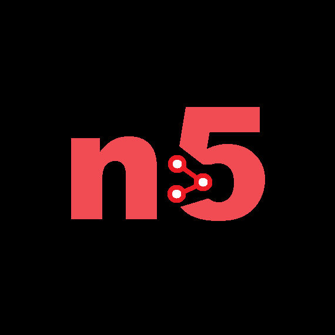

# n5 Deep Learning Framework 🚀

<p align="center">
  
</p>

A lightweight, dynamic deep learning framework built completely from scratch in Python and NumPy. It features a custom structural `.n5` model serialization and storage architecture.

---

## 🌟 Core Technical Architecture

- **Dynamic Computational Graph (Autograd)**: A custom reverse-mode automatic differentiation engine that dynamically tracks matrix operations and builds evaluation graphs on the fly.
- **Zero-Dependency Core**: Pure mathematical and algorithmic implementation relying strictly on NumPy for high-performance matrix mechanics—no black-box modern ML libraries.
- **Proprietary `.n5` Format**: A custom binary sequential file structure designed for lightweight, fast model serialization, saving both structural metadata and raw tensor weights.

---

## 🛠️ Repository Structure

```text
├── check_point/   # Directory containing experimental and historical backups
├── n5.py          # Framework Core (Tensor class, Autograd engine, Layer modules)
├── main.py        # Entry point (Training pipelines and framework verification)
├── module.n5      # Compiled custom structural binary weights file
├── LICENSE        # Ironclad Proprietary & Non-Commercial License
└── README.md      # System documentation
```

### ⚠️ Note on the `check_point` Directory
The `check_point/` folder is used exclusively for historical version control and architectural backups. 
- Some legacy versions stored inside this directory **may be corrupted, unstable, or broken** due to breaking changes during development.
- Other checkpoints contain functional, working iterations of the engine. Use these historical files with caution during academic testing.

---

## 💻 Developer Quick Start Guide

### 1. Graph Initialization & Forward Pass
```python
import numpy as np
from n5 import Tensor, Linear

# Initialize an input Tensor with gradient tracking enabled
x = Tensor([[0.5, -0.2, 0.1]], requires_grad=True)

# Define a Structural Linear (Dense) layer (3 inputs -> 4 outputs)
layer = Linear(3, 4)

# Execute dynamic forward propagation
output = layer.forward(x)
print("Forward Pass Matrix Output:\n", output.data)
```

### 2. Reverse-Mode Autograd Execution
```python
# Compute gradients automatically across the computational graph
output.backward()

# Extract calculated weight gradients from the layer
print("Evaluated Weight Gradients:\n", layer.w.grad)
```

### 3. Model Serialization (`.n5`)
```python
from n5 import save_n5, load_n5

# Serialize the active layers dynamically into the custom .n5 format
save_n5(layer, "module.n5")
print("Model dynamically compiled and saved as module.n5")

# De-serialize and load weights back into a structural module
# load_n5("module.n5", layer)
```

---

## ⚖️ Proprietary Legal Terms & Restrictions

This software is strictly governed by an **Ironclad Proprietary, Exclusive Copyright & Non-Commercial License**. All rights are reserved exclusively to **soufian2024**.

- **Authorized Usage**: Granted strictly to natural persons for individual **academic learning, personal software study, and non-profit university research**.
- **Commercial Prohibition**: Selling, leasing, licensing, redistributing, or exploiting this codebase, its underlying mathematical structures, or the `.n5` file extension for corporate or monetary profit is strictly forbidden.
- **AI Training Ban**: No Artificial Intelligence (AI) models, Large Language Models (LLMs), or web scrapers are permitted to ingest, parse, or train upon this source code. Structural plagiarism claimed as "AI-generated derivatives" is legally actioned.
- **Plagiarism Enforcement**: You cannot modify, fork, or rebrand this micro-framework to distribute it under another developer's name or brand.

> **Legal Action**: Breach of these terms immediately revokes all permissions, triggering global DMCA takedowns, digital copyright strikes, and aggressive international litigation for maximum financial damages.

---

## 🧑‍💻 Exclusive Legal Owner
- **Copyright Owner**: [@soufian2024](https://github.com)
- **Engine & Format**: `n5` Deep Learning Framework & `.n5` Serialization Format (c) 2024-2026.
